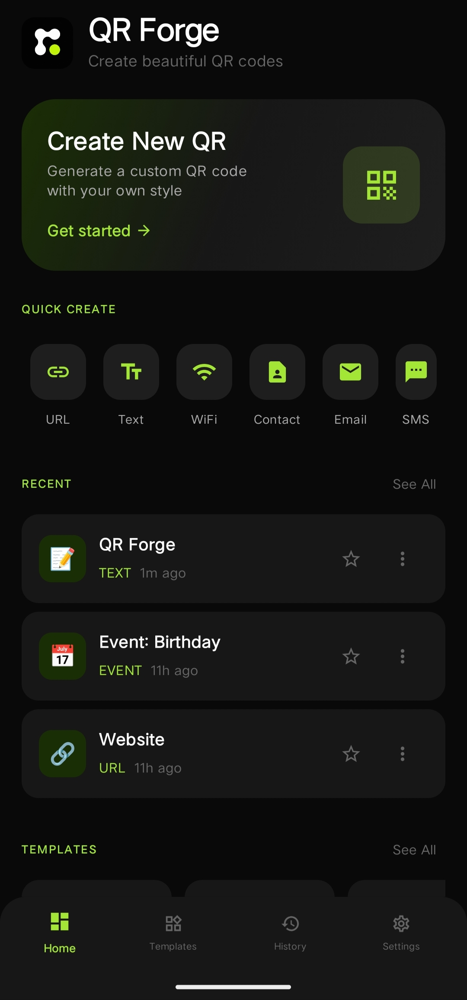
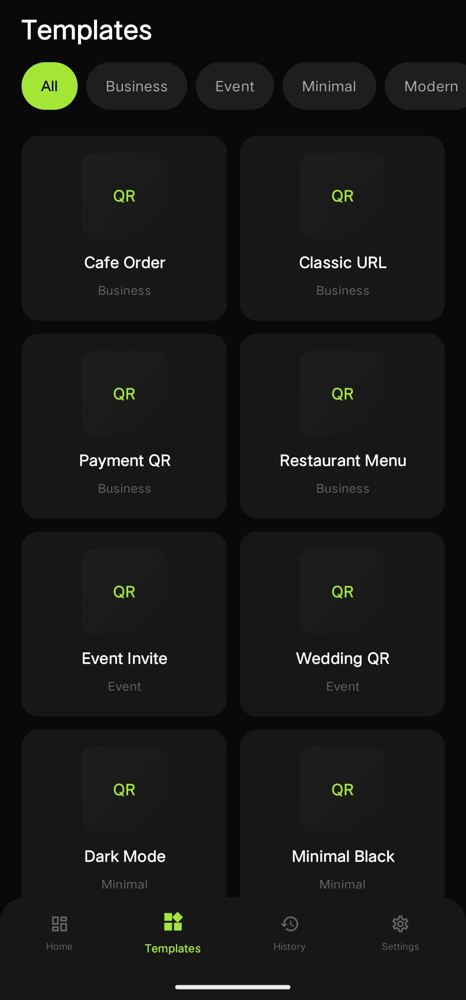
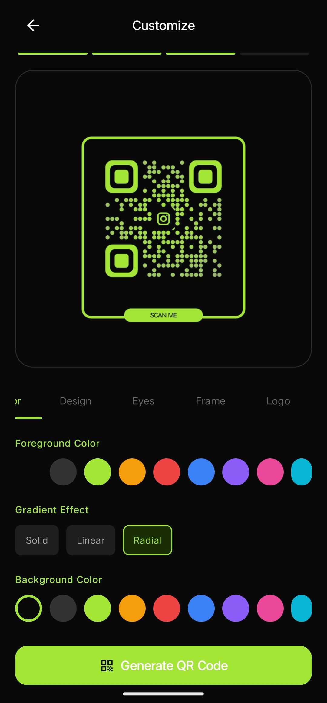

# 📱 QR Forge

### Premium Offline QR Code Generator for Android


---

# 📖 Overview

**QR Forge** is a modern Android QR Code Generator designed with a premium user experience in mind.

Unlike traditional QR generators, QR Forge focuses on beautiful customization, fast offline generation, reusable templates, and a clean mobile-first interface.

Generate professional QR codes for websites, Wi-Fi, contacts, social media, documents, and more—all without requiring an internet connection.

---

## 📥 Download

Download the latest APK from the **Releases** section.

👉 **Latest Release**

https://github.com/YOUR_USERNAME/QR-Forge/releases/latest

---

### Home



---

# ⭐ Highlights

- Completely offline QR generation
- Premium dark UI built with Jetpack Compose
- Real-time QR preview
- Multiple QR content types
- Custom color & style customization
- QR templates
- Local history system
- PNG export
- Share generated QR codes
- Fast and lightweight

---

# 🎯 Purpose

QR Forge provides a fast and reliable way to create customized QR codes directly on Android.

Perfect for:

- Students
- Developers
- Businesses
- Freelancers
- Restaurants
- Events
- Personal sharing

No accounts.
No ads.
No cloud processing.

---

# ✨ Features

## 📌 QR Types

Generate QR codes for:

- URL / Website
- Plain Text
- Wi-Fi
- Contact (vCard)
- Email
- SMS
- Phone Number
- Location
- PDF
- Audio
- Social Media

---

## 🎨 QR Customization

Personalize your QR with:

- Custom foreground colors
- Background colors
- Multiple QR templates
- Frame styles
- Logo support
- Live preview before generation

---

## 📂 Local History

Automatically stores generated QR codes.

History includes:

- QR type
- Title
- Generated time
- Preview
- Favorite support

---

## 📤 Export & Share

Export QR codes as:

- PNG

Share directly using Android's native Share Sheet.

---

# 🏗 Architecture

```text
Jetpack Compose UI
        │
        ▼
    ViewModel (MVVM)
        │
        ▼
 Repository Layer
        │
        ▼
 QR Generator Engine
        │
        ▼
 Local Storage (Room)
```

---

# 🛠 Technology Stack

## Android

- Kotlin
- Jetpack Compose
- Material 3

---

## Architecture

- MVVM
- StateFlow
- Navigation Compose

---

## Storage

- Room Database
- DataStore

---

## QR Generation

- ZXing

---

## Image Loading

- Coil

---

# 📸 Screenshots

### Templates



### Customize



### Generated QR


---

# 📦 Installation

## Clone Repository

```bash
git clone https://github.com/d-ghosh717/QR-Forge

cd QRForge
```

---

## Open Project

Open with the latest version of Android Studio.

---

## Build

```bash
./gradlew build
```

or simply click **Run** inside Android Studio.

---

# 🚀 Requirements

Minimum:

- Android 8.0 (API 26)
- 2 GB RAM

Recommended:

- Android 11+
- 4 GB RAM+

---

# 🎯 Roadmap

## ✅ Completed

- Offline QR Generation
- Multiple QR Types
- QR Templates
- QR Customization
- Local History
- PNG Export
- Share QR
- Modern Android UI

---

## 🚧 Planned

- SVG Export
- PDF Export
- Dynamic QR Codes
- Batch QR Generation
- Cloud Backup
- Material You Accent Support
- Wear OS Companion
- QR Scanner
- Home Screen Widget

---

# 🤝 Contributing

Contributions are welcome.

1. Fork the repository
2. Create a feature branch
3. Commit your changes
4. Open a Pull Request

---

# 📜 License

This project is intended for educational, learning, and portfolio purposes.

---

# 👨‍💻 Author

QR Forge is a modern Android application built to provide a premium, offline-first QR code generation experience with a strong focus on clean design, performance, and usability.